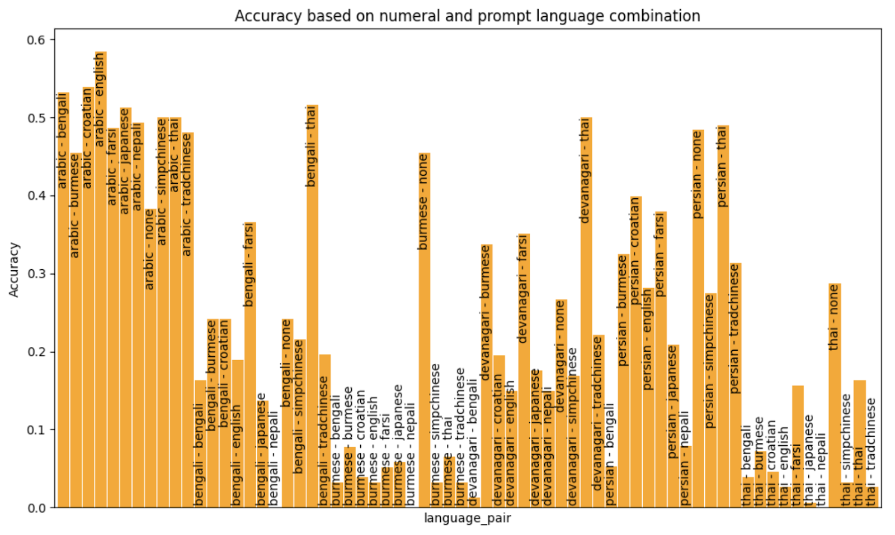

# LLMmath

Testing LLMs on math in different languages and prompt formats.

Processes large batches of prompts of GPT-4 for testing the effect of different languages and numeral systems on GPT-4's ability to solve three-digit multiplication problems. 

In the current experimental setup, languages include English, Chinese (Simplified and Traditional), Farsi, Bengali, Burmese, Japanese, Croatian and Thai. Numeral systems include Arabic, Persian, Devanagari, Bengali, Burmese, and Thai. Prompts are centered on understanding how languages affect the "Chain of thought" process in GPT-4.

Parallel processing is used throughout to enable fast tests. The code can be adapted to other experiments.

Original research done as part of SERI MATS by Ethan Edwards

```

```

Initial write-up here: https://ethanedwards.substack.com/p/finding-the-language-of-thought-in

Install requirements with pip
'''
pip install -r requirements.txt
'''

main.py is the current main function which will run the latest expeirment
'''
python main.py
'''

Currently configured to use OpenAI API, variables for which should be handled in an .env file with the variables 
'''
OPENAI_ORG_KEY
OPENAI_ORG_KEY
'''
or can be modified in config.py.